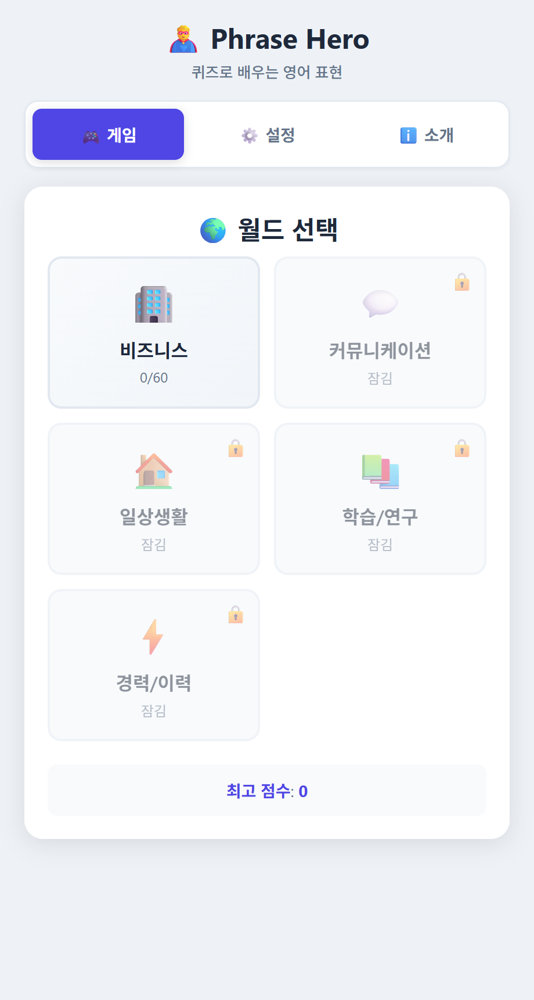
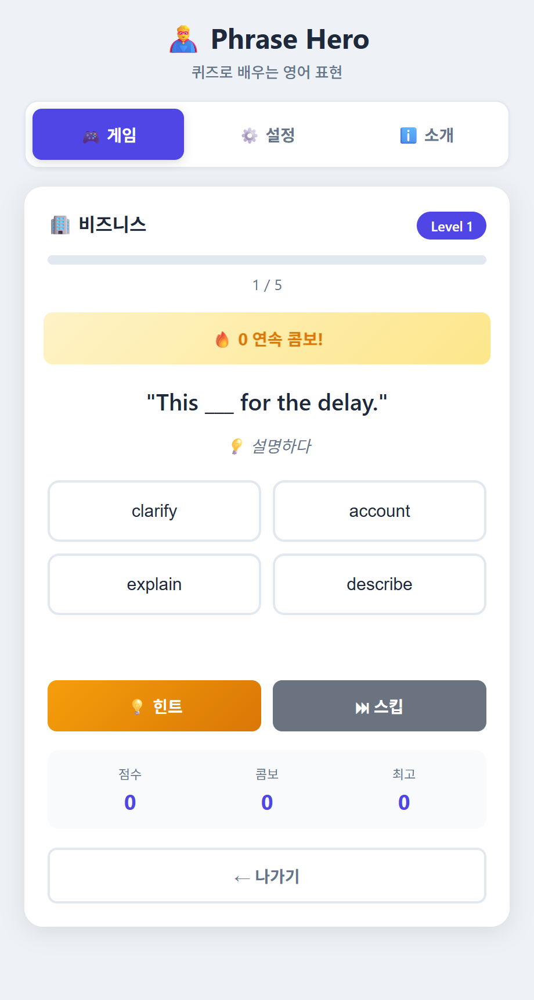
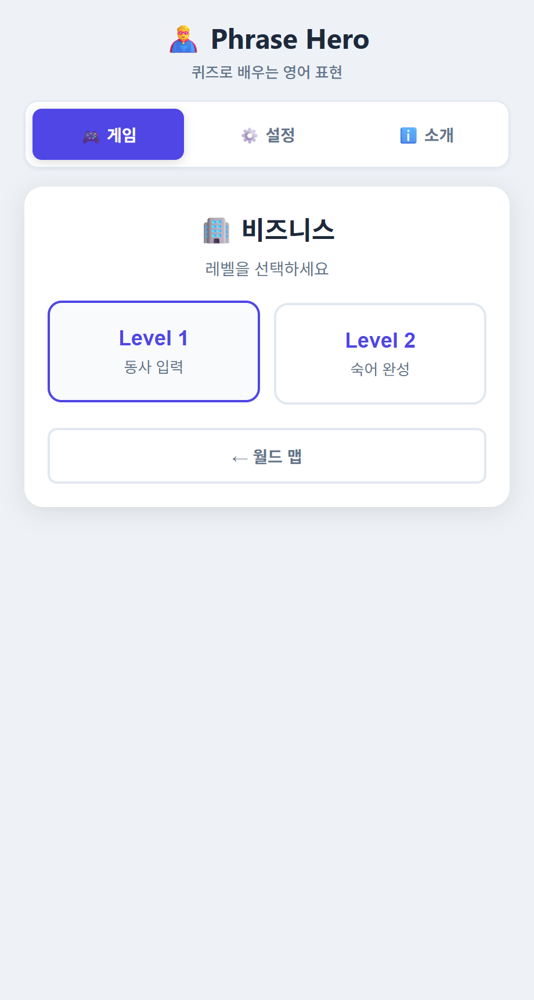
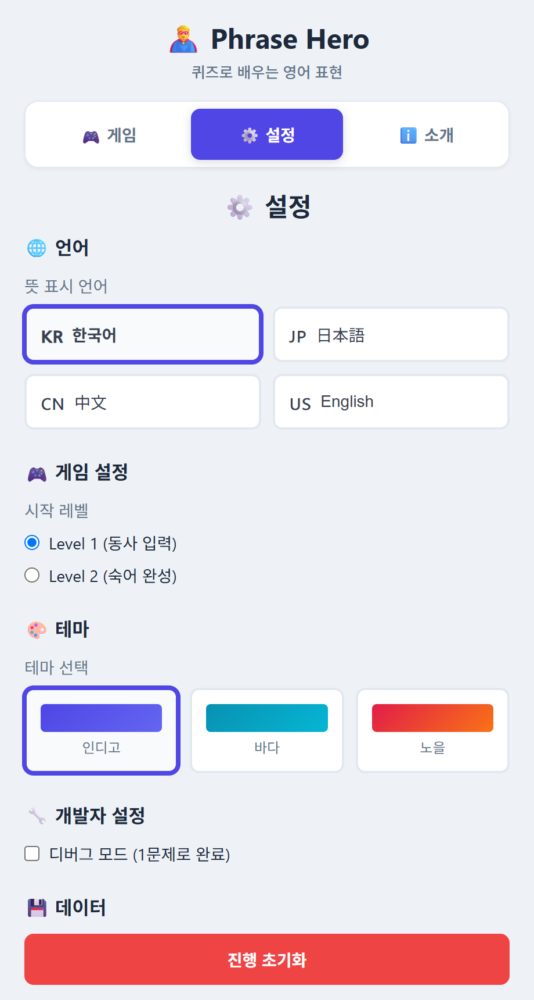

# 🦸 Phrase Hero

> Learn English phrases with quizzes — a multilingual vocabulary game for non-native learners.

Phrase Hero is a Chrome side-panel extension that helps you master common English phrases
(phrasal verbs & expressions) through quick, click-based quizzes. Because most learners of
English are **not** native speakers, the meanings are shown in your own language — Korean,
Japanese, Chinese, or English.

한국어 · 日本語 · 中文 · English 지원.

## ✨ Features

- **Multilingual meanings** — the English phrase is shared by everyone; only the explanation
  changes per language (🇰🇷 한국어 / 🇯🇵 日本語 / 🇨🇳 中文 / 🇺🇸 English).
- **Two quiz levels**
  - **Level 1** — choose the correct verb from 4 tiles.
  - **Level 2** — build the full phrase (verb + preposition) in order.
- **Answer reveal** — after a correct answer, the full sentence translation is shown briefly
  to reinforce learning.
- **Worlds & progression** — Business, Communication, Daily Life, and more, unlocked as you go.
- **Combo & scoring** — time and combo bonuses, stars, and ranks.
- **Themes** — calm neutral look with Indigo / Ocean / Sunset accent colors.
- Progress and settings are saved locally in your browser.

## 📸 Screenshots

| World map | Level 1 quiz |
|---|---|
|  |  |
| **Level select** | **Settings (language & theme)** |
|  |  |

## 🚀 Installation (Load Unpacked)

1. Clone or download this repository.
2. Open Chrome and go to `chrome://extensions/`.
3. Turn on **Developer mode** (top-right toggle).
4. Click **Load unpacked** and select the project folder.
5. Click the Phrase Hero icon in the toolbar to open the side panel.

## 🎯 How to Play

1. Pick a **world** from the map.
2. Choose **Level 1** or **Level 2**.
3. Read the English sentence and the meaning in your language, then tap the tiles to answer.
4. Get a correct answer to see the full translation, build combos, and clear the world.

Change the meaning language and accent theme anytime in the **Settings** tab.

## 🗂️ Project Structure

| File | Purpose |
|------|---------|
| `manifest.json` | Chrome Extension config (Manifest V3) |
| `background.js` | Service worker — opens the side panel on toolbar click |
| `sidepanel.html` | UI markup |
| `sidepanel.css` | Styles & themes |
| `sidepanel.js` | Game logic and i18n |
| `sidepanel-data.js` | Phrase data (4 languages) + UI string tables |
| `icons/` | Extension icons (16 / 48 / 128) |

## 🔧 Development

Edit the source files, then go to `chrome://extensions/` and click the **Reload** icon on the
extension to see your changes.

To add a language, extend the `LANGUAGES` list, add a matching block to `I18N`, and add the
`meaning.<code>` entries for each phrase in `sidepanel-data.js`.

## 📄 License

MIT — free to use and modify.

---

Made with ❤️ for English learners everywhere.
